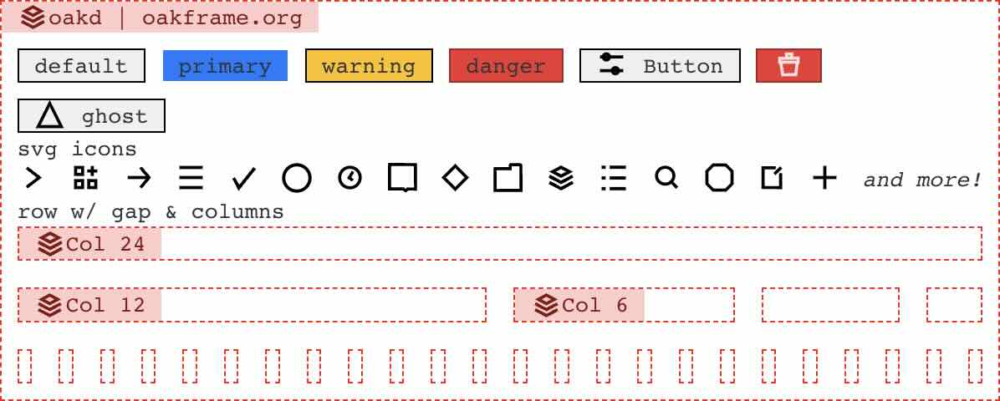

# **oakd React Component Library**

A scalable and efficient TypeScript React component library for modern applications.

[](https://opensource.org/licenses/MIT)   



---  

## 📦 **Installation**

To start using `oakd`, install it via npm:
```sh  
npm install oakd  
```  

Then, **import the styles** in your `App.tsx` (or wherever you use `oakd` components):
```tsx  
import 'oakd/build/index.css';  
```  

---  

## 🚀 **Development**

### ✅ **Testing**

Run all tests using Jest:
```sh  
npm run test  
```  

Jest is configured to:
- Use `ts-jest` for TypeScript support.
- Ignore `node_modules/`.
- Output coverage reports in the `coverage/` directory.

### 📦 **Building**

Compile the library for production:
```sh  
npm run build  
```  

**Rollup is configured to:**
- Output both CommonJS (`build/index.js`) and ES modules (`build/index.esm.js`).
- Copy `index.css` to `build/` automatically.
- Support image imports with `@rollup/plugin-image`.

### 📖 **Storybook**

Start a live-reloading Storybook instance:
```sh  
npm run storybook  
```  

Export Storybook as static files:
```sh  
npm run storybook:export  
```  

Serve the generated `storybook-static/` folder.

---  

## ✨ **Generating New Components**

Easily scaffold a new component using:
```sh  
npm run generate YourComponentName  
```  

This generates:
```sh  
/src/YourComponentName  
  ├── YourComponentName.tsx  
  ├── YourComponentName.mdx
  ├── YourComponentName.stories.tsx  
  ├── YourComponentName.test.tsx  
  ├── YourComponentName.types.ts  
  ├── YourComponentName.css  
```  

Modify templates under `util/templates` as needed.  
Don’t forget to export your new component in `index.ts`!

---  

## 🔗 **Installing Locally**

To test `oakd` in another project (`test-app`) **without publishing**, run:
```sh  
npm i --save ../oakd  
```  

This adds an entry in `package.json`:
```json  
"dependencies": {  
  "oakd": "file:../oakd"  
}  
```  

### ⚠ **Common Issue: Invalid Hook Call**

If you see:
```sh  
Invalid hook call. Hooks can only be called inside the body of a function component.  
```  
This likely means multiple versions of React are installed.  
Fix it by linking React from the consuming app:
```sh  
npm link ../test-app/node_modules/react  
```  
Alternatively, configure Webpack as suggested [here](https://github.com/facebook/react/issues/13991#issuecomment-435587809).

---  

## 📦 **Publishing**

### **📤 Publishing to NPM**

Ensure you're logged in:
```sh  
npm login  
```  

Update `package.json` with your NPM package name, then publish:
```sh  
npm publish  
```  

The `"prepublishOnly": "npm run build"` script ensures a fresh build before publishing.

### **🛠 Hosting via GitHub**

Alternatively, push the built package to GitHub and install it via:
```sh  
npm i --save git+https://github.com/arkamedus/oakd.git#branch-name  
```  
or
```sh  
npm i --save github:arkamedus/oakd#branch-name  
```  

---  

## 🎨 **Styling**

### **Importing Styles**

Include the library’s styles in your project:
```tsx  
import 'oakd/build/index.css';  
```  

### **Using CSS Variables**

Utilize predefined CSS variables from `variables.css`:
```css  
.example-container {  
    color: var(--col-white);  
    background-color: var(--col-black);  
}  
```  

More on [CSS Variables](https://developer.mozilla.org/en-US/docs/Web/CSS/Using_CSS_custom_properties).

---  

## 📌 **Usage Example**

After installation, use components like:
```tsx  
import React from "react";  
import 'oakd/build/index.css';  
import { Title } from "oakd";  

const App = () => (  
  <div className="app-container">  
    <Title>Hello from oakd</Title>  
    <Paragraph>Some content</Paragraph>
  </div>  
);  

export default App;  
```  

---  

## 🛠 **Additional Features**

### **🌙 Dark Mode Support**

Automatically adapts to dark mode using:
```css  
@media (prefers-color-scheme: dark) { ... }  
```  
Customization options are in [`src/index.css`](src/index.css).

### **📦 CSS Preprocessor Support**

Supports **Sass, Less, Stylus** via:
```sh  
yarn add node-sass --dev  # Sass  
yarn add stylus --dev      # Stylus  
yarn add less --dev        # Less  
```  

For **CSS Modules**, update `rollup-config.js`:
```js  
postcss({  
  modules: true  
})  
```  

### **💅 Styled Components**

See [this branch](https://github.com/HarveyD/react-component-library/tree/styled-components) for implementation.

### **📂 Code Splitting**

Load components on demand:
```tsx  
import TestComponent from 'oakd/build/TestComponent';  
```  

For setup, refer to [this commit](https://github.com/HarveyD/react-component-library/commit/94631be5a871f3b39dbc3e9bd3e75a8ae5b3b759).

### **🖼 Image Importing**

Image imports **now work automatically** without additional configuration. You can use:
```tsx  
import logo from "./logo.png";  
export const ImageComponent = () => ;  
```  

### **📜 JSON Importing**

Install JSON plugin:
```sh  
npm i -D @rollup/plugin-json  
```  

Add it to `rollup-config.js`:
```js  
plugins: [json(), ...]  
```  

Now you can import JSON files:
```tsx  
import data from "./some-data.json";  
export const JsonDataComponent = () => <div>{data.description}</div>;  
```  

---  

## 🔗 **Resources & Links**

- [📘 Storybook Docs](https://storybook.js.org/)
- [⚡ Rollup Plugins](https://github.com/rollup/plugins)
- [🎨 CSS Variables](https://developer.mozilla.org/en-US/docs/Web/CSS/Using_CSS_custom_properties)
- [💅 Styled Components](https://styled-components.com/)

---  

## 🤝 **Contributing**

We welcome contributions! Open an issue or submit a PR to improve `oakd`.  
For detailed contribution guidelines, refer to our **[Contributing Guide](CONTRIBUTING.md)**.

---  

### **📣 Join the Discussion**

Have questions or ideas? Feel free to reach out on GitHub Discussions or open an issue! 🚀